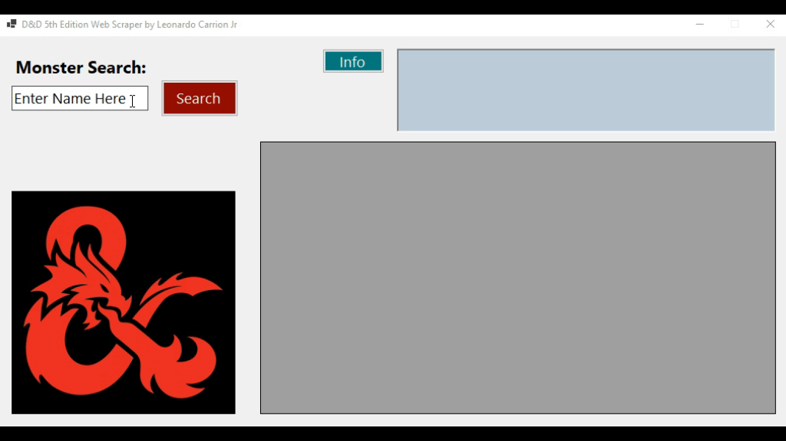

Thanks for checking out my portfolio! Explore my sample projects through the links below. If you're interested in diving deeper, full project files are available for download via the links in the banner above, giving you an opportunity to examine my code implementations in more detail. If you'd like to contact me, send me a message using the contact form on my [LINKTREE](https://linktr.ee/LeonardoCarrion)

 

|Web Scraper Demo|
|:-------------:|
|&nbsp;&nbsp;&nbsp;[CLICK HERE](./webScraper.md)&nbsp;&nbsp;&nbsp;|

 
 

|State Machine Demo|
|:-------------:|
|&nbsp;&nbsp;&nbsp;[CLICK HERE](./stateMachine.md)&nbsp;&nbsp;&nbsp;|

 
 

|ScriptableObject To JSON Demo|
|:-------------:|
|&nbsp;&nbsp;&nbsp;[CLICK HERE](./scriptableObject2JSON.md)&nbsp;&nbsp;&nbsp;|

 
 
