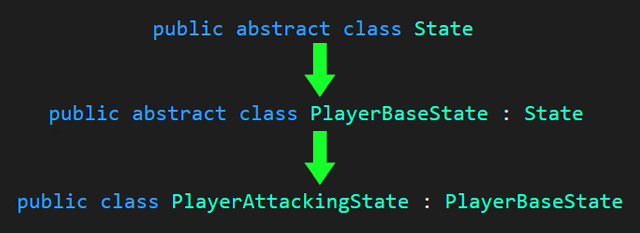
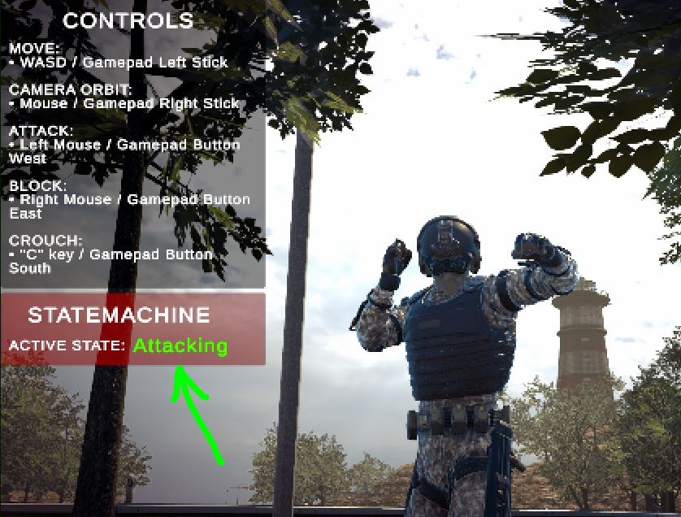

[>> BACK TO HOME PAGE <<](./README.md)

# State Machine: Dynamic Game Object Behavior System

State Machines, or Finite State Machines (FSMs) as they are sometimes referred to, are a key tool in game development, enabling game objects to dynamically change their behaviors in response to different conditions. FSMs are particularly useful for driving player characters, but they can also be applied to control inanimate objects, allowing for complex and customizable gameplay design.

One of the best features of state machines is their modular architecture. Each set of behaviors, or 'state,' is self-contained and independent, making modifications and extension pretty straightforward. Another strength is that shared functionality can be encapsulated in parent classes, allowing child classes to inherit that shared functionality. This reduces copy-paste redundancy and improves overall scalability.

To see the state machine in action, click the link at the top right of the banner to visit my GitHub and download the **StateMachineBuild.zip** file.

<a href="https://theblueturtle.github.io/github-portfolio/StateMachine.gif" target="_blank">
  
</a>


## ~~~~~~~~~~~~~~~~~~~~~~~~~~~~~~~~~~~~~~~~~~~

## BREAKDOWN - PlayerInputReader.cs
This class serves as the communication bridge between Unity’s input system and the custom code that makes up the state machine, translating user input into action. The main mechanism for this communication is events. This class implements the **PlayerControls.IPlayerActions** interface, which is part of Unity's input system setup.

```c#
public class PlayerInputReader : MonoBehaviour, PlayerControls.IPlayerActions{}
```

<br>
<br>

When the user hits a button on the keyboard or gamepad, that action is interpreted by the **PlayerControls** class and relayed to the **PlayerInputReader** class via the events defined in **“IPlayerAction”**. The **PlayerInputReader** class receives the notification and triggers the state machine to respond with the corresponding state behavior.

```c#
void PlayerControls.IPlayerActions.OnAttack(InputAction.CallbackContext context)
{
    Log("InputAction \"Attack\" performed");

    if (context.performed) { IsAttacking = true; Log("Attack InputAction performed - InputSystemReader"); }
    else if (context.canceled) { IsAttacking = false; Log("Attack InputAction canceled - InputSystemReader"); }
}

```

<br>
<br>

I use properties extensively here, allowing specific states to monitor changes in response to user input. Since input can be rapid and unpredictable, properties let you interrupt state behaviors to keep controls responsive.
```c#	
public bool IsCrouching { get; private set; }
public Vector2 MovementValueL { get; private set; }
```

<br>
<br>

Notice that some of the properties are bools and others are vectors. These types correspond to Unity's input action types. For example, joystick input returns an **X & Y** vector, so it's mapped to a **Vector2** property. Buttons, on the other hand, are mapped to **bools** for **on/off** conditions.

## ~~~~~~~~~~~~~~~~~~~~~~~~~~~~~~~~~~~~~~~~~~~

## BREAKDOWN - StateMachine.cs
This class is the heart of the system. It's an abstract class, meaning it is meant to be inherited from and not used directly. It also inherits from **MonoBehaviour** to tap into Unity’s lifecycle methods (**Awake, Start(), Update(), etc.**).

```c#
public abstract class StateMachine : MonoBehaviour {}
```

<br>
<br>

I define a **“State”** field that allows me to initialize a new state and pass it into the state machine. Inside the Update() method, I call the active state’s Tick() method to execute per-frame logic, if necessary. And finally, I define a **"SwitchState()"** method which takes in an instance of a state. This method transitions between states, calling **"Exit()"** on the current state and **"Enter()"** on the new one.

```c#	
public void SwitchState(State newState)
{
    currentState?.Exit();
    currentState = newState;
    currentState?.Enter();
}
```

## ~~~~~~~~~~~~~~~~~~~~~~~~~~~~~~~~~~~~~~~~~~~

## BREAKDOWN - State.cs
The State class defines the structure of each state, which includes an **"Enter()"**, **"Tick()"**, and **"Exit()"** method. **"Enter()"** is called as soon as the state begins executing, **"Tick()"** runs every frame, and **"Exit()"** triggers when the state completes or is interrupted. Like the **StateMachine** class, this is also abstract, intended for other states to inherit from.

```c#	
public abstract class State{}
```

```c#	
public abstract void Enter();
public abstract void Tick(float deltaTime);
public abstract void Exit();
```

<br>
<br>

I mentioned earlier that inheritance can be used to share logic between states. The **“GetNormalizedTime()”** function is an example of that. Defining that function here allows any state to reuse this logic. I mark the function as protected so the child classes can access it.

```c#	
protected float GetNormalizedTime(Animator animator){}
```

## ~~~~~~~~~~~~~~~~~~~~~~~~~~~~~~~~~~~~~~~~~~~

## BREAKDOWN - PlayerStateMachine.cs
The first thing to note here is this class inherits from the abstract **StateMachine** class we defined earlier. It contains the specific implementation logic. It defines various fields to manage things like communication with external components and controls to fine-tune state machine behavior.

```c#	
public class PlayerStateMachine : StateMachine {}
```

```c#	
[field: SerializeField] public PlayerInputReader PlayerInputReader { get; private set; }
[field: SerializeField] public float CrouchMovementSpeed { get; private set; }
```

<br>
<br>

On Start() I make sure to initiate the very first state I want the character to enter when the game starts.

```c#	
private void Start() { SwitchState(new PlayerFreeMoveState(this)); }
```

## ~~~~~~~~~~~~~~~~~~~~~~~~~~~~~~~~~~~~~~~~~~~

## BREAKDOWN - PlayerAttackingState.cs
Each state has their own unique setup so for the sake of brevity let's look at **PlayerAttackingState** to outline the core functionality of all the states. First, notice this class inherits from **PlayerBaseState** which is yet another abstract class that contains some shared logic specific to the player. Recall I mentioned state machines can be used by non-player objects as well. That is the reason for the additional branching here. The inheritance goes as follows: 

**State.cs  >>  PlayerBaseState.cs  >>  PlayerAttackingState.cs**



```c#	
public class PlayerAttackingState : PlayerBaseState {}
```

<br>
<br>

The constructor takes in the **PlayerStateMachine** instance and an **"attackIndex"**. The base constructor from **PlayerBaseState** is then called to initialize the attack. The attack index assigns the correct attack from the stored list of attacks in the state machine.

```c#	
public PlayerAttackingState(PlayerStateMachine stateMachine, int attackIndex) : base(stateMachine) 
{
    attack = stateMachine.Attacks[attackIndex];
}
```

<br>
<br>

Here is an example of the **PlayerFreeMoveState** using the above constructor to initiate a new attack when the player hits the left mouse button/ west gamepad button. The **“IsAttacking”** bool is one of those monitoring properties I spoke about earlier in the **PlayerInputReader** section.

```c#	
if (stateMachine.PlayerInputReader.IsAttacking)
{
    stateMachine.SwitchState(new PlayerAttackingState(stateMachine, 0));
    return;
}
```

<br>
<br>

The **"Enter()"** method here does a few things. Notably the **"ReportActiveState(“Attacking”)"** function is what updates the **Active State:** readout in the game's UI. With this you can monitor what the state machine is doing at any given moment.

```c#	
stateMachine.ReportActiveState("Attacking");
```



<br>
<br>

Then I call the correct attack animation from the animator component and transition into it.

```c#	
stateMachine.Animator.CrossFadeInFixedTime(attack.AnimationName, attack.TransitionDuration);
```

<br>
<br>

Inside Tick(), it checks the attack animation’s playback. If the animation completes and **"IsAttacking"** is true, it chains another attack to create a combo. If **"IsAttacking"* is false, it returns to **PlayerFreeMoveState**.

```c#	
if(normalizedTime < 1f)
{
    if (stateMachine.PlayerInputReader.IsAttacking) { ChainAttack(normalizedTime); }
}
else { stateMachine.SwitchState(new PlayerFreeMoveState(stateMachine)); }
```

<br>
<br>

[>> BACK TO HOME PAGE <<](./README.md)
