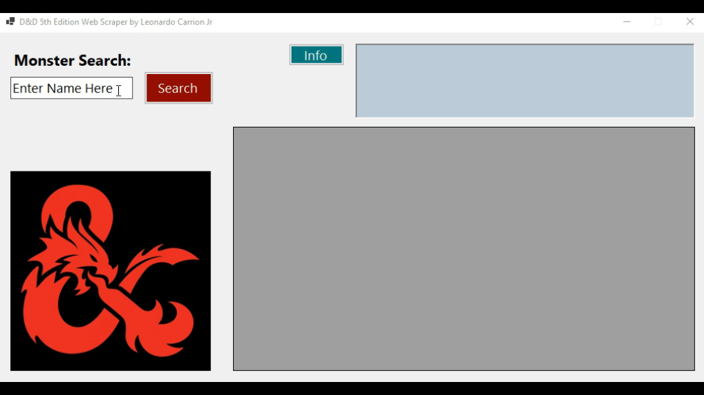

[>> BACK TO HOME PAGE <<](./README.md)

# Web Scraper: RESTful API Data Retrieval

Web scraping is an incredibly useful skill to have in your coding toolkit. The ability to communicate with web APIs or extract data from raw HTML can unlock endless possibilities—from predictive analysis to real-time data visualization.

For this project, I developed a D&D (5th Edition) web scraper for monsters using WinForms, .NET 8.0, and C#. True to my nerdy roots, this web scraper pulls data from the Official 5th Edition SRD using a RESTful API.

If you'd like to check out the project in action, download a copy of the <a href="https://drive.google.com/file/d/1XxE1e7nI0UD_msOr_Lu4457UA34lZhMU/view?usp=sharing" target="_blank">**D&D5thEdition_WebScraper.zip**</a> from my Google Drive. To access the code described below, click the link at the top right of the banner to visit my GitHub and download the **DnD5thEditionWebScraperClassFiles.zip** file.

<a href="https://theblueturtle.github.io/github-portfolio/DnDWebScraper.gif" target="_blank">
  
</a>

## ~~~~~~~~~~~~~~~~~~~~~~~~~~~~~~~~~~~~~~~~~~~

## BREAKDOWN - DnD5thEditionWebScraper.cs
This class manages all user interactions, including input validation, button events, and displaying the scraped data in the UI. The first line initializes an instance of **DnDAPILogic**, which handles data processing and API calls. The class constructor sets up the **DnDAPILogic** component and a few other things.

```c#
private DnDAPILogic dndAPILogicComponent;
//...
dndAPILogicComponent = new DnDAPILogic();
```

<br>
<br>

The main function, **"buttonExecuteScrape_Click"**, is tied to the **"Search"** button in the UI. It initiates the asynchronous web request to keep the UI from locking up. Here I trigger the **"ExecuteScrape()"** function and pass in an instance of a **Progress<int>** object. This object triggers callbacks to update the progress bar in the UI.

```c#
private async void buttonExecuteScrape_Click(object sender, EventArgs e) {}

var progress = new Progress<int>(value =>
            {
                progressBarScraper.Value = value;
            });

string result = await dndAPILogicComponent.ExecuteScrape(progress, userInputValidated, userInputRaw);
```

<br>
<br>

Depending on whether the request succeeds or fails, I print an error message or process the returned JSON data.

```c#
if (result.Contains("Request Failed:"))
{
    // Handle failure
}
else
{
    dndAPILogicComponent.PopulateData(labelMonsterName, dataGridViewDisplay, result);
    System.Drawing.Image imageResponse = dndAPILogicComponent.DownloadMonsterImage();
    pictureBoxEntry.Image = imageResponse ?? Properties.Resources.dndImageDefault;
}
```

## ~~~~~~~~~~~~~~~~~~~~~~~~~~~~~~~~~~~~~~~~~~~

## BREAKDOWN - DnDAPILogic.cs

This class does most of the heavy lifting. It handles the HTTP requests, formats the data for the data grid view in the UI, and downloads the monster images if available. The **"ExecuteScrape()"** function fetches data from the API using an HTTP client.

```c#
public async Task<string> ExecuteScrape(IProgress<int> progress, string userInput, string userInputRaw)
```

<br>
<br>

Here I use an embedded using statement to initialize the HTTP client instance and pass it the API url. This is done to make sure the instance is disposed of when it goes out of scope via the **IDisposable** interface. Among other things this helps to prevent memory leaks and frees up system resources as soon as they're no longer in use.

```c#
using (var client = new HttpClient())
{
    string apiUrl = "https://www.dnd5eapi.co/api/monsters/" + userInput;
    HttpResponseMessage response = await client.GetAsync(apiUrl);
}
```

<br>
<br>

If the response succeeds, I return the data. If it fails I return an error message.

```c#
if (response.IsSuccessStatusCode) { ... }
```

<br>
<br>

The **“PopulateData()”** method does all the parsing and formatting. I parse the data into a **JsonDocument** to more easily target and extract the data I’m interested in.

```c#
public void PopulateData(Label monsterNameLabel, DataGridView dataGridViewControl, string responseContent)
{
    //…

    var jsonString = JsonDocument.Parse(responseContent);

```

<br>
<br>

Next, I extract and format all the data. The method of extraction differs slightly from property to property depending on how nested in the json structure the property is and how I want the string formatted. Here are two examples.

```c#
//Example A
string typeLabel = "Type: ";
string typeValue = jsonString.RootElement.GetProperty("type").ToString();
string type = typeLabel + typeValue;

//Example B
List<string> specialAbilitiesCollection = new List<string>();
if (jsonString.RootElement.TryGetProperty("special_abilities", out JsonElement specialAbilitiesElement))
{
    foreach (JsonElement property in specialAbilitiesElement.EnumerateArray())
    {
        string abilityName = property.GetProperty("name").ToString();
        specialAbilitiesCollection.Add(abilityName);
    }
}
```

<br>
<br>

The data is displayed in a **DataGridView** control with custom rows and headers.

```c#
dataGridViewControl.Columns.Add("Column1", string.Empty);
dataGridViewControl.Rows.Add(monsterName);
InsertHeaderRow(dataGridViewControl, "Nature");
```
<br>
<br>

The **"DownloadMonsterImage()"** method sends a second HTTP request to fetch the monster's image if it exists. This is encased in a try catch block to handle cases where the image url is missing.

```c#
try
{
    using (var client = new HttpClient())
    {
        var response = client.GetAsync("https://www.dnd5eapi.co" + monsterImageURL).Result;
    }
}
```
<br>
<br>

If the image comes back successfully, I pass it to a helper method called **“ResizeImage()”** to redraw the image in a smaller size to fit the UI. That operation goes into an embedded using statement to make sure the graphics object is disposed of promptly. Drawing with the graphics object can be resource intense.

```c#
Bitmap resizedImage = new Bitmap(targetWidth, targetHeight);
using (Graphics graphics = Graphics.FromImage(resizedImage))
{
    graphics.DrawImage(originalImage, 0, 0, targetWidth, targetHeight);
}
```
<br>
<br>

[>> BACK TO HOME PAGE <<](./README.md)
